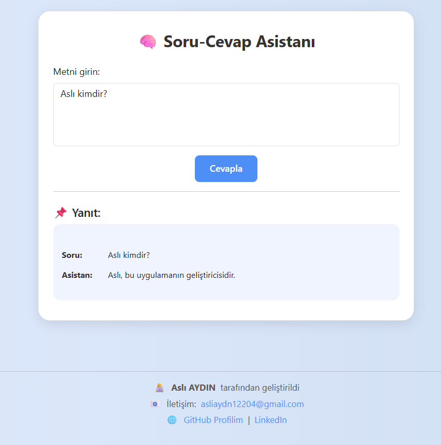

# 🧠 Soru-Cevap Asistanı

Bu basit bir kural tabanlı yapay zeka demo projesidir. Kullanıcıdan alınan metne göre cevap üretir ve sade bir arayüzle sunar. Flask tabanlı backend ve Bootstrap destekli frontend yapısı ile geliştirilmiştir.

## 🎯 Projenin Amacı

Bu proje, temel yapay zeka mantığını ve web geliştirme becerilerini birleştirerek:
- Kullanıcıdan gelen bir metne cevap üretmek
- Flask ile backend işleyişini anlamak
- Bootstrap ile responsive ve şık bir arayüz oluşturmak

gibi hedefleri gerçekleştirmek üzere geliştirilmiştir.

## 🖼️ Ekran Görüntüsü

> Ana ekran örneği:

## ⚙️ Kullanılan Teknolojiler

- Python 3
- Flask
- HTML5 / CSS3
- Bootstrap 5
- Jinja2 (Flask şablon motoru)
